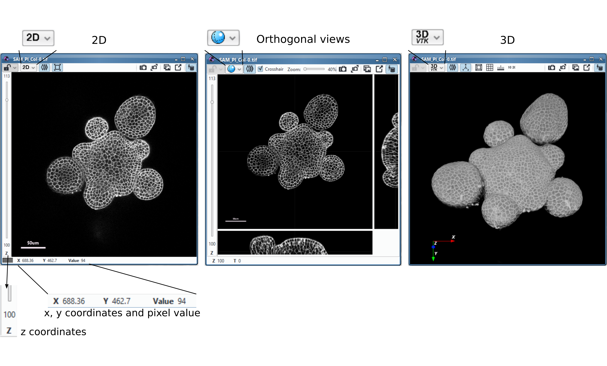
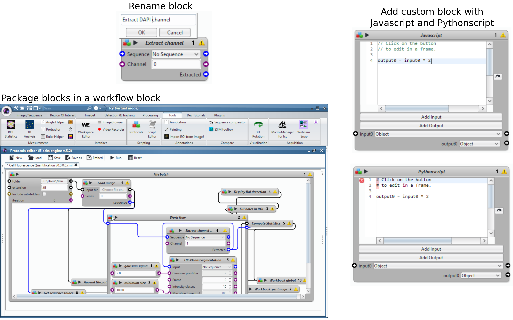
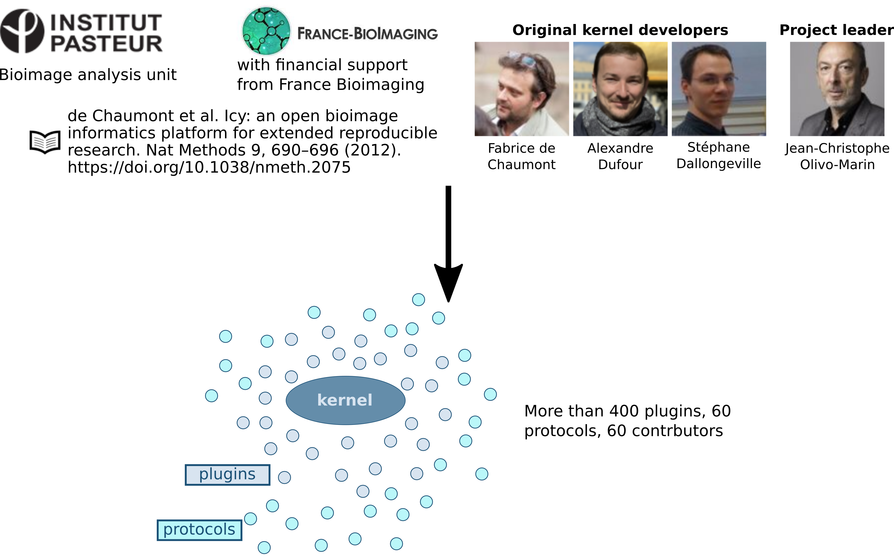

```{r setup, include=FALSE}
options(htmltools.dir.version = FALSE)
library(here)
```

layout: true

<div class="my-header"></div>
<div class="my-footer">
  <div class="my-info">
      <a href="https://marionlouveaux.fr/">marionlouveaux.fr</a>
      <a href="https://twitter.com/MarionLouveaux">@MarionLouveaux</a>
  </div>
  <div class="my-logo">
  </div>
</div>       

---


# Introduction     
        
- Icy, a bioimage analysis software bridging people accross disciplines           
- Protocols, making quantitative analyses accessible to everyone          
- Community, get involved!            

---
# Icy, a bioimage analysis software bridging people accross disciplines  

Icy offers the means for 
- perform quantitative analyses in a reproducible manner, even without programming knowledge            
- get the latest image analysis and computer vision algorithms in an accessible manner         
- easily share bioimage analysis workflows with the very diverse bioimage analysis community        


```{r, echo=FALSE}

```


---
# Protocols, making quantitative analyses accessible to everyone  

Protocols offers the means for       
- automated processing without programming knowledge       
- flexibility required to achieve complex tasks      
- transparency and reproducibility       

```{r, echo=FALSE}

```


---
# Community, get involved!  

Icy is a community effort, relying on:     
- the existence and renewal/updating of resources      
- communication around these resources      
- sharing knowledge   

```{r, echo=FALSE}

```


---
# Poll n°1

**Choose what applies to you most**           
- I do image analysis for my projects only     
- I do image analysis for the others only         
- I do image analysis for myself and for the others        

**Your knowledge of Icy**
- I never heard about Icy     
- I heard about Icy but never used it      
- I used Icy it a couple of times         
- I used Icy many times       

---
# Outline

1. Icy, a bioimage analysis software bridging people accross disciplines                          
2. Protocols, making quantitative analyses accessible to everyone                 
3. Community, get involved!           

---
# Icy: The origins of the Icy software      

```{r, echo=FALSE}

```

---
# Icy: The choice of a developed & unified GUI            

```{r, echo=FALSE}
knitr::include_graphics("images/GUI.png")
```

> Image: SAM_PI_Col-0.tif, from http://doi.org/10.5281/zenodo.2577053   

???
1. A unified graphical user interface       
      - No floating windows      
      - Unified plugins layout     
      - Condensed information (see the side pane)
2. Everything at your fingertips
      - Ribbon menu: quick access to basic operations & main plugins      
      - Side pane: display options, ROI manager with result table, overlays control, history and log window       
3. Make the software easier to use       
      - Search bar: access all tools, even if not yet installed
      - Direct access to online documentation & website     
      - Possibility to send bug reports and log files directly from the GUI       

---
# Icy: Display options & sequence properties        
         
```{r, echo=FALSE}
knitr::include_graphics("images/GUIsidepane.png")
```

> Image: SAM_PI_Col-0.tif, from http://doi.org/10.5281/zenodo.2577053  
       

---
# Icy: Viewer options 
         
```{r, echo=FALSE}

```

> Image: SAM_PI_Col-0.tif, from http://doi.org/10.5281/zenodo.2577053  

---
# Icy: Windows synchronization         

![:col_row 

```{r, echo=FALSE, out.width="100%"}
knitr::include_graphics("images/GUIsynchroviewer.png")
```
]  
![:col_row 
<center>
<iframe width="400" height="250" src="https://www.youtube.com/embed/EQyM1UQw4xc?list=PLTzQ6G6h35v9fC0tkJ_2ZNLfm5SN1ZLlv" frameborder="0" allow="accelerometer; autoplay; encrypted-media; gyroscope; picture-in-picture" allowfullscreen></iframe>
</center>

]

> Image: SAM_PI_Col-0.tif, from http://doi.org/10.5281/zenodo.2577053  

---
# Icy: Results            

```{r, echo=FALSE}
knitr::include_graphics("images/ROIs.png")
```

> Image: image_1.tif, from https://zenodo.org/record/3706554#.XpgUbZk6-Uk 

---
# Icy identity: Code      

```{r, echo=FALSE}

```
> http://icy.bioimageanalysis.org/download/     

---
# Icy identity: Code  

```{r, echo=FALSE}
knitr::include_graphics("images/Plugins2.png")
```

> http://icy.bioimageanalysis.org/plugins/

---
# Icy: Highlighting some plugins    

Counting spots with *Spot detector*             

```{r, echo=FALSE, out.width="80%"}

```

![:col_row Segmentation with <i>Active contours</i>, Tracking with <i>Track Manager</i>, Flow analysis with <i>BioFlow</i>]
![:col_row 
```{r, echo=FALSE, out.width="75%"}

```
,
```{r, echo=FALSE, out.width="100%"}
knitr::include_graphics("images/221219-ICY-MOVIES - 25X 54 (crop)_TrackingAmoeba.gif")
```
,
```{r, echo=FALSE, out.width="100%"}
knitr::include_graphics("images/bioflow_2D.gif")
```
]         
![:col_row Credits: D. Gaboriau, Credits: M. Manich, Boquet-Pujadas et al. (2017)]

> http://icy.bioimageanalysis.org/plugin/spot-detector/         
http://icy.bioimageanalysis.org/plugin/active-contours/          
http://icy.bioimageanalysis.org/plugin/track-manager/         
http://icy.bioimageanalysis.org/plugin/bioflow/        

???
extract motion of intracellular material observed using fluorescence
microscopy, while simultaneously inferring the parameters of a given theoretical model 
actin bulk flow   

---
# Icy: 3D rotation plugin          

![:col_row 

```{r, echo=FALSE, out.width="80%"}
knitr::include_graphics("images/3Drotationplugin.png")
```
,

```{r, echo=FALSE, out.width="100%"}
knitr::include_graphics("images/3D rotated view of SAM_PI_Col-0_0ms.gif")
```
]

> http://icy.bioimageanalysis.org/plugin/3d-rotation/     
 

---
# Icy: Protocols         

```{r, echo=FALSE}

```

> http://icy.bioimageanalysis.org/protocol/3d-mouse-embryo-quantification/         
http://icy.bioimageanalysis.org/plugin/protocols/       


---
# Icy: Interoperability with other tools          

```{r, echo=FALSE}

```


---
# Icy: Conclusions     

- Unified graphical user interface       
- Large variety of plugins
- Graphical programming option        


---
# Questions? 


---
# Poll n°2

**The 1st part of this webinar has...**       
- ... triggered my interest for Icy     
- ... not quite raised my interest for Icy yet         

**Protocols and graphical programming (not limited to Icy)**     
- I never heard about it    
- I already heard about it but never tried       
- I am familiar and have used it a couple of times          
- I use it often        

**Your knowledge in at least one programming language**        
- zero programming knowlegde      
- basic knowlegde      
- intermediate knowlegde      
- advanced knowledge          

---
# Outline

1. Icy, a bioimage analysis software bridging people accross disciplines                           
2. Protocols, making quantitative analyses accessible to everyone                 
3. Community, get involved!             

---
# Protocols: Common issues     

```{r, echo=FALSE}

```

---
# Protocols: Definition of bioimage analysis    

```{r, echo=FALSE}
knitr::include_graphics("images/bioimage_analysis_workflow.png")
```

---
# Protocols: Example      

```{r, echo=FALSE}

```

<br>
<br>

> http://icy.bioimageanalysis.org/protocol/cell-fluorescence-quantification/           
https://zenodo.org/record/3706554#.XpgUbZk6-Uk        


---
# Protocols: Definition of workflow

```{r, echo=FALSE}

```

> http://icy.bioimageanalysis.org/protocol/cell-fluorescence-quantification/           
https://zenodo.org/record/3706554#.XpgUbZk6-Uk        

---
# Protocols: A protocol is a workflow     

```{r, echo=FALSE}

```

> http://icy.bioimageanalysis.org/protocol/cell-fluorescence-quantification/           
https://zenodo.org/record/3706554#.XpgUbZk6-Uk        


---
# Protocols:  A protocol is a workflow   

```{r, echo=FALSE}
knitr::include_graphics("images/WorkflowExampleFormalisedwithLegends.png")
```

> http://icy.bioimageanalysis.org/protocol/cell-fluorescence-quantification/           
https://zenodo.org/record/3706554#.XpgUbZk6-Uk        

---
# Protocols: Loading a protocol  

**From a local repository**     

<iframe width="700" height="400" src="https://www.youtube.com/embed/YGaZC6trDWc" frameborder="0" allow="accelerometer; autoplay; encrypted-media; gyroscope; picture-in-picture" allowfullscreen></iframe>

> http://icy.bioimageanalysis.org/protocol/cell-fluorescence-quantification/           
https://zenodo.org/record/3706554#.XpgUbZk6-Uk  

---
# Protocols: Loading a protocol  

**From the online Icy repository**    

<iframe width="700" height="400" src="https://www.youtube.com/embed/guVS7Vq7-ZQ" frameborder="0" allow="accelerometer; autoplay; encrypted-media; gyroscope; picture-in-picture" allowfullscreen></iframe>

> http://icy.bioimageanalysis.org/protocol/cell-fluorescence-quantification/           
https://zenodo.org/record/3706554#.XpgUbZk6-Uk  

---
# Protocols: Getting started           

<iframe width="700" height="400" src="https://www.youtube.com/embed/jDvWOU_Actk?list=PLTzQ6G6h35v-QMfXPnzm8Tfcm_T09KwBE" frameborder="0" allow="accelerometer; autoplay; encrypted-media; gyroscope; picture-in-picture" allowfullscreen></iframe>

> http://icy.bioimageanalysis.org/protocol/cell-fluorescence-quantification/           
https://zenodo.org/record/3706554#.XpgUbZk6-Uk  


---
# Protocols: Getting started           


```{r, echo=FALSE}

```


---
# Protocols: Add a block           


<iframe width="700" height="400" src="https://www.youtube.com/embed/3OhFIF8wOnc" frameborder="0" allow="accelerometer; autoplay; encrypted-media; gyroscope; picture-in-picture" allowfullscreen></iframe>

> http://icy.bioimageanalysis.org/protocol/cell-fluorescence-quantification/           
https://zenodo.org/record/3706554#.XpgUbZk6-Uk  

---
# Protocols: Run the protocol           


<iframe width="700" height="400" src="https://www.youtube.com/embed/OVoGznelsEQ" frameborder="0" allow="accelerometer; autoplay; encrypted-media; gyroscope; picture-in-picture" allowfullscreen></iframe>

> http://icy.bioimageanalysis.org/protocol/cell-fluorescence-quantification/           
https://zenodo.org/record/3706554#.XpgUbZk6-Uk  

---
# Protocols: Automation - Batch processing             


```{r, echo=FALSE}

```

> http://icy.bioimageanalysis.org/protocol/cell-fluorescence-quantification/           
https://zenodo.org/record/3706554#.XpgUbZk6-Uk  

---
# Protocols: Automation - Headless mode              

<iframe width="700" height="400" src="https://www.youtube.com/embed/KI57cNbGDyg" frameborder="0" allow="accelerometer; autoplay; encrypted-media; gyroscope; picture-in-picture" allowfullscreen></iframe>

> http://icy.bioimageanalysis.org/protocol/cell-fluorescence-quantification/           
https://zenodo.org/record/3706554#.XpgUbZk6-Uk  

---
# Protocols: Flexibility   

```{r, echo=FALSE}

```
> http://icy.bioimageanalysis.org/protocol/cell-fluorescence-quantification/           
https://zenodo.org/record/3706554#.XpgUbZk6-Uk  

---
# Protocols: Flexibility          

Workflow block to organize other blocks        

<iframe width="700" height="400" src="https://www.youtube.com/embed/YOvG5D7Kf78" frameborder="0" allow="accelerometer; autoplay; encrypted-media; gyroscope; picture-in-picture" allowfullscreen></iframe>

> http://icy.bioimageanalysis.org/protocol/cell-fluorescence-quantification/           
https://zenodo.org/record/3706554#.XpgUbZk6-Uk  

---
# Protocols: Ethics and Reproducibility     

**Transparency** 
- Steps of the workflow are visible      
- All steps and corresponding parameters are stored in the .xml 

**Reproducibility**
- Automated analysis    

**Tips**        
=> Add a DOI with Zenodo on your protocol and test data    
=> Share your protocol on the Icy website, add documentation and link to test data          


```{r, echo=FALSE}
knitr::include_graphics("images/Ethics.png")
```


---
# Protocols: Conclusions                

- Automation without programming knowledge            
- Yet flexible      
- Reproducible and transparent    

---
# Questions? 


---
# Poll n°3

**The 2nd part of the webinar has...**       
- ... triggered my interest for protocols        
- ... not quite yet raised my interest for protocols        

**I find graphical programming...**      
- easier than regular programming     
- as difficult as regular programming     
- harder than regular programming           

---
# Outline

1. Icy, a bioimage analysis software bridging people accross disciplines                           
2. Protocols, making quantitative analyses accessible to everyone                 
3. Community, get involved!                   


---
# Community: From lab effort to community effort      

```{r, echo=FALSE}

```


---
# Community: The Icy team      

**Community involvement of the Icy team**     

- Maintain Icy 2.0

- Prepare the future of Icy        

- Foster the community dynamic      
    - Maintain the website     
    - Communicate around Icy         

The Icy team recently started another project: Icy Services, selling services around Icy for industrials or academics. See http://icy.bioimageanalysis.org/services/       


---
# Community: Resources      


```{r, echo=FALSE, out.width="100%"}

```

---
# Community: Communication      

*In scientific publications* 
- **Cite Icy**: de Chaumont et al. Icy: an open bioimage informatics platform for extended reproducible research. Nat Methods 9, 690–696 (2012). https://doi.org/10.1038/nmeth.2075   
- **Cite the plugins** you use: reference in the online documentation     
- **Publish your protocol**: upload it on the Icy website, add a snapshot in the supplementals, link to test data                   

*On Twitter*    
Did you publish recently a paper using Icy? Did follow a course on Icy ? Do you have a favorite plugin? Are you proud of your last protocol? **Share** it!      

In your tweets: 
- **@Icy_Bioimaging** to notify the Icy team            
- **#BioimageAnalysis**, automatic retweet by the Twitter bot @Talk_BioImg

**Follow @Icy_Bioimaging** to get news from the Icy team.             

---
# Community: Help on Icy related topics           

**Looking for help**   

1. Read the online plugins documentation http://icy.bioimageanalysis.org/ 
2. Read the training materials http://icy.bioimageanalysis.org/trainings/            
3. Search the forums https://forum.image.sc/ and http://icy.bioimageanalysis.org/topics/     


**Still looking for help?**    

Right now, you can still ask questions here:  http://icy.bioimageanalysis.org/topics/     
*but* we are in the process of joining the https://forum.image.sc/ as community partners, more info soon...  


**Helping others**       
Anybody can give help, no need to be an expert. Be active on the forum(s) as helper!     


---
# Community: Conclusions      

- Getting involved in the Icy community starts with communicating about the Icy resources you use: cite, tweet...       
- The community involvement is crucial    


---
# Questions? 


---
# Poll n°4

**Following part 3, in the next 6 months, I am likely to... (tick all the ones that apply to you)**
- try Icy at least once     
- use Icy on a regular basis       
- cite Icy        
- tweet about Icy     
- go back to this presentation      
- submit a protocol on the Icy website     
- teach how to use Icy      
- ask for help      
- help others               


---
# Acknowledgements 

Big big thanks to: 
- NEUBIAS and NEUBIAS Academy              
- Moderators: Julien Colombelli, Ofra Golani, Rocco D'Antuono, Stéphane Dallongeville and Daniel Felipe Gonzalez Obando             
- Icy team     
- Jessica Quintin, Stéphane Rigaud, Stéphane Verger, Maria Manich and David Gaboriau for images and protocols       


Don't forget to register to the other **NEUBIAS Academy @home** events!!      
http://eubias.org/NEUBIAS/training-schools/neubias-academy-home/ 

Please fill the satisfaction **survey**.     


